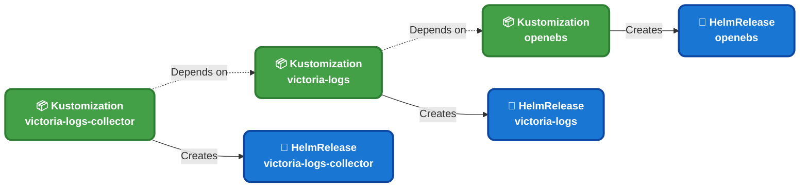

<div align="center">


##  My Home Operations Repository 

... a GitOps-driven homelab managed with [Flux](https://github.com/fluxcd/flux2), [Renovate](https://github.com/renovatebot/renovate), and [GitHub Actions](https://github.com/features/actions) 

</div>

<div align="center">

[](https://talos.dev)&nbsp;
[](https://kubernetes.io)&nbsp;
[](https://fluxcd.io)&nbsp;
[](https://github.com/pwyde/home-ops/pulls)&nbsp;
[](https://github.com/pwyde/home-ops/actions/workflows/renovate.yaml)

</div>

<div align="center">

[](https://github.com/home-operations/kromgo)&nbsp;
[](https://github.com/home-operations/kromgo)&nbsp;
[](https://github.com/home-operations/kromgo)&nbsp;
[](https://github.com/home-operations/kromgo)&nbsp;
[](https://github.com/home-operations/kromgo)&nbsp;
[](https://github.com/home-operations/kromgo)&nbsp;
[](https://github.com/home-operations/kromgo)

</div>

---

##  Overview

This mono repository serves as the single source of truth for my home(lab) infrastructure and single-node Kubernetes cluster, following Infrastructure as Code (IaC) and GitOps best practices.

The cluster is automated with the following tools:

- [Talos Linux](https://github.com/siderolabs/talos) — Immutable, API-driven OS that runs nothing but Kubernetes.
- [Flux](https://github.com/fluxcd/flux2) — Continuous reconciliation of cluster state against this repository.
- [Renovate](https://github.com/renovatebot/renovate) — Automated dependency updates across the entire cluster.
- [GitHub Actions](https://github.com/features/actions) — Validation and automation on every commit.

This ensures an immutable and reproducible environment, with changes applied automatically based on repository state.

---

##  Repository Structure

```sh
📁 bootstrap     # One-time cluster bootstrap (helmfile + kustomize)
📁 docker        # Services running via Docker on NAS
📁 kubernetes    # Everything Flux reconciles
├─📁 apps        # Workloads, grouped by namespace
├─📁 components  # Reusable Kustomize components (alerts, volsync, etc.)
└─📁 flux        # Flux system configuration
📁 talos         # Talos machine configs and per-node overrides
```

---

##  Cluster

The cluster operates on [Talos Linux](https://www.talos.dev/), an immutable and ephemeral Linux distribution tailored for [Kubernetes](https://kubernetes.io/), deployed on bare-metal [Minisforum MS-A2](https://minisforumpc.eu/products/ms-a2-mini-pc) workstation. Persistent storage is provided by [OpenEBS](https://openebs.io/) with bulk media offloaded to [TrueNAS SCALE](https://www.truenas.com/truenas-scale) NAS over NFS.

### Core Components

- [actions-runner-controller](https://github.com/actions/actions-runner-controller) — Self-hosted GitHub runners for CI/CD workflows.
- [cert-manager](https://github.com/cert-manager/cert-manager) — Automated SSL certificate management and provisioning.
- [cilium](https://github.com/cilium/cilium) — High-performance container networking powered by [eBPF](https://ebpf.io).
- [cloudflared](https://github.com/cloudflare/cloudflared) — Secure tunnel providing Cloudflare-protected access to cluster services.
- [envoy-gateway](https://github.com/envoyproxy/gateway) — Modern ingress controller for cluster traffic management.
- [external-dns](https://github.com/kubernetes-sigs/external-dns) — Automated DNS record synchronization for ingress resources.
- [external-secrets](https://github.com/external-secrets/external-secrets) — Kubernetes secrets management integrated with [1Password Connect](https://github.com/1Password/connect).
- [openebs](https://github.com/rook/rook) — Persistent container native storage with local [Hostpath](https://openebs.io/docs/user-guides/local-storage-user-guide/local-pv-hostpath/hostpath-overview) and [ZFS](https://openebs.io/docs/user-guides/local-storage-user-guide/local-pv-zfs/zfs-overview).
- [spegel](https://github.com/spegel-org/spegel) — Stateless cluster-local OCI registry mirror for improved performance.
- [volsync](https://github.com/backube/volsync) — Advanced backup and recovery solution for persistent volume claims.

---

##  GitOps

[Flux](https://fluxcd.io/) continuously monitors the Kubernetes clusters defined in the [kubernetes](./kubernetes) directory and reconciles their state with the configuration stored in the Git repository.

To deploy applications, Flux recursively scans the `kubernetes/apps` directory and identifies the highest-level `kustomization.yaml` file within each application directory. Each discovered `kustomization.yaml` is then applied together with all resources it references.

In most cases, these top-level `kustomization.yaml` files contain a namespace definition and one or more Flux `Kustomization` resources (`ks.yaml`). These Flux `Kustomizations` manage the deployment of application-specific resources, such as `HelmRelease` objects and any additional Kubernetes manifests required by the application.

[Renovate](https://github.com/renovatebot/renovate) monitors the entire repository for dependency updates. When updates are available, Renovate automatically creates a pull request. Once a pull request is reviewed and merged, Flux reconciles the updated repository state and applies the corresponding changes to the Kubernetes clusters.

### Deployment Workflow

The diagram below provides a high-level overview of how Flux manages application deployments and dependency ordering.

In most scenarios, a `HelmRelease` depends on one or more other `HelmRelease` resources. In other cases, a `Kustomization` depends on one or more other `Kustomization` resources. Less commonly, an application may require a combination of both `HelmRelease` and `Kustomization` dependencies.

Flux evaluates these dependencies and ensures that resources are deployed and upgraded in the correct order. A dependent resource will not be reconciled until all of its declared dependencies have been successfully deployed and are reporting a healthy state.

In the example below, the `victoria-logs-collector` application depends on `victoria-logs`, which in turn depends on `openebs`. As a result, `openebs` must be successfully deployed and healthy before `victoria-logs` is installed or upgraded. Likewise, `victoria-logs` must be healthy before `victoria-logs-collector` can be deployed or updated.


```mermaid
graph LR
    classDef kustom fill:#43A047,stroke:#2E7D32,stroke-width:3px,color:#fff,font-weight:bold,rx:10,ry:10
    classDef helm fill:#1976D2,stroke:#0D47A1,stroke-width:3px,color:#fff,font-weight:bold,rx:10,ry:10

    A["📦 Kustomization<br/>victoria-logs"]:::kustom
    B["📦 Kustomization<br/>victoria-logs-collector"]:::kustom
    C["📦 Kustomization<br/>openebs"]:::kustom
    D["🎯 HelmRelease<br/>victoria-logs"]:::helm
    E["🎯 HelmRelease<br/>victoria-logs-collector"]:::helm
    F["🎯 HelmRelease<br/>openebs"]:::helm

    A -->|Creates| D
    B -->|Creates| E
    C -->|Creates| F
    A -.->|Depends on| C
    B -.->|Depends on| A
```

---

##  Networking

_To be documented..._

### DNS

The cluster runs two separate [ExternalDNS](https://github.com/kubernetes-sigs/external-dns) instances, each responsible for managing DNS records in a different environment.

The first instance manages public DNS records and synchronizes them to Cloudflare. The second instance synchronizes private DNS records to a UCG Fiber gateway using the [ExternalDNS UniFi webhook](https://github.com/home-operations/external-dns-unifi-webhook/) provider.

This separation is achieved through the use of two ingress classes:

- `internal` — Used for services that require private DNS records.
- `external` — Used for services that require public DNS records.

Based on the assigned ingress class, the corresponding ExternalDNS instance automatically discovers the ingress resources and creates or updates DNS records on the appropriate platform. This approach provides clear separation between internal and external services while ensuring that DNS records remain synchronized with the cluster's configuration.

---

##  Cloud Dependencies

While most services are self-hosted, certain critical components rely on cloud services to ensure availability, especially in bootstrapping scenarios.

| Service                                         | Purpose                                                                | Cost              |
|-------------------------------------------------|------------------------------------------------------------------------|-------------------|
| [1Password](https://1password.com/)             | Secret management via [External Secrets](https://external-secrets.io/) | ~€40/yr           |
| [Cloudflare](https://www.cloudflare.com/)       | DNS and secure access via Cloudflare Tunnel                            | Free              |
| [GitHub](https://github.com/)                   | Repository hosting and CI/CD                                           | Free              |
| [Mailgun](https://mailgun.com/)                 | Automatic email delivery                                               | Free (Flex Plan)  |
| [Name.com](https://www.name.com/)               | Domain registration                                                    | ~€55/yr           |
| [Pushover](https://pushover.net/)               | Infrastructure alerts and notifications                                | $5 (One Time Fee) |
| [Tailscale](https://tailscale.com/)             | Secure private remote access                                           | Free              |
|                                                 |                                                                        | **~€8/mo**        |

---

##  Hardware

| Device                       | Count | OS Disk    | Data Disk                        | RAM   | OS            | Function             |
| ---------------------------- | ----- | ---------- | -------------------------------- | ----- | ------------- | -------------------- |
| Minisforum MS-A2             | 1     | 1.92TB M.2 | 3.84TB U.2, 1.92TB M.2           | 96GB  | Talos         | Kubernetes           |
| Inter-Tech 4U-4416           | 1     | 2x1TB M.2  | 2x1TB SSD, 4x12TB HDD, 4x8TB HDD | 256GB | TrueNAS SCALE | NFS & Backup Storage |
| PiKVM V4 Plus                | 1     | -          | -                                | -     | -             | KVM for Kubernetes   |
| UniFi Cloud Gateway Fiber    | 1     | -          | -                                | -     | UniFi OS      | Firewall & Router    |
| UniFi Aggregation            | 1     | -          | -                                | -     | UniFi OS      | 10G SFP+ Switch      |
| UniFi Pro 24 PoE             | 1     | -          | -                                | -     | UniFi OS      | 1GbE PoE+ Switch     |
| UniFi AC Pro                 | 2     | -          | -                                | -     | UniFi OS      | WiFi 5 Access Point  |

### Minisforum MS-A2 Build

- **CPU**: AMD Ryzen™ 9 9955HX
- **RAM**: [Crucial 96GB (2x48GB) DDR5-5600 SODIMM CT2K48G56C46S5](https://www.crucial.com/memory/ddr5/CT2K48G56C46S5)
- **M.2 Storage**: [Samsung PM9A3 1.92TB M.2 22110 NVMe PCIe 4.0 x4 MZ1L21T9HCLS](https://semiconductor.samsung.com/ssd/datacenter-ssd/pm9a3/)
- **U.2 Storage**: [Samsung PM9A3 3.84TB U.2 NVMe PCIe 4.0 x4 MZQL23T8HCLS](https://semiconductor.samsung.com/ssd/datacenter-ssd/pm9a3/)
- **Case**: [Minisforum MS-A2](https://minisforumpc.eu/products/ms-a2-mini-pc)

### Inter-Tech 4U-4416 Build

- **CPU**: AMD EPYC™ 7002 (Rome)
- **RAM**: [Samsung 256GB (8x32GB) DDR4-2666 ECC RDIMM M393A4K40CB2-CTD](https://semiconductor.samsung.com/dram/module/rdimm/m393a4k40cb2-ctd/)
- **Motherboard**: [Supernicro H12SSL-i](https://www.supermicro.com/en/products/motherboard/H12SSL-i)
- **M.2 Storage**: [Samsung 980 PRO 1TB M.2 2280 NVMe PCIe 4.0 x4 MZ-V8P1T0BW](https://www.samsung.com/uk/memory-storage/nvme-ssd/980-pro-pcle-4-0-nvme-m-2-ssd-1tb-mz-v8p1t0bw/)
- **SSD Storage**: [WD Red SA500 NAS 1TB SATA SSD  WDS100T1R0A](https://www.sandisk.com/products/ssd/internal-ssd/wd-red-sata-2-5-ssd?sku=WDS100T1R0A-68A4W0)
- **HDD Storage**: [WD Red Pro 12TB SATA 7200 RPM 256MB Cache WD120EFBX](https://www.westerndigital.com/en-ie/products/internal-drives/wd-red-pro-sata-hdd)
- **HDD Storage**: [WD Red Plus 8TB SATA 5400 RPM 256MB Cache WD80EFAX](https://www.westerndigital.com/en-ie/products/internal-drives/wd-red-plus-sata-3-5-hdd)
- **Storage Controller**: [ServeRAID M1215 SAS/SATA Controller](https://lenovopress.com/tips1174-serveraid-m1215)
- **Case**: [Inter-Tech 4U-4416](https://www.inter-tech.de/productdetails-142/4U-4416_EN.html)


---

##  Thanks

A special thanks to the [Home Operations](https://discord.gg/home-operations) Discord community for their insights and inspiration. Many ideas stem from shared clusters under the [k8s-at-home](https://github.com/topics/k8s-at-home) GitHub topic and the excellent [Kubesearch](http://kubesearch.dev/) tool.

---

##  License

See [LICENSE](./LICENSE)
