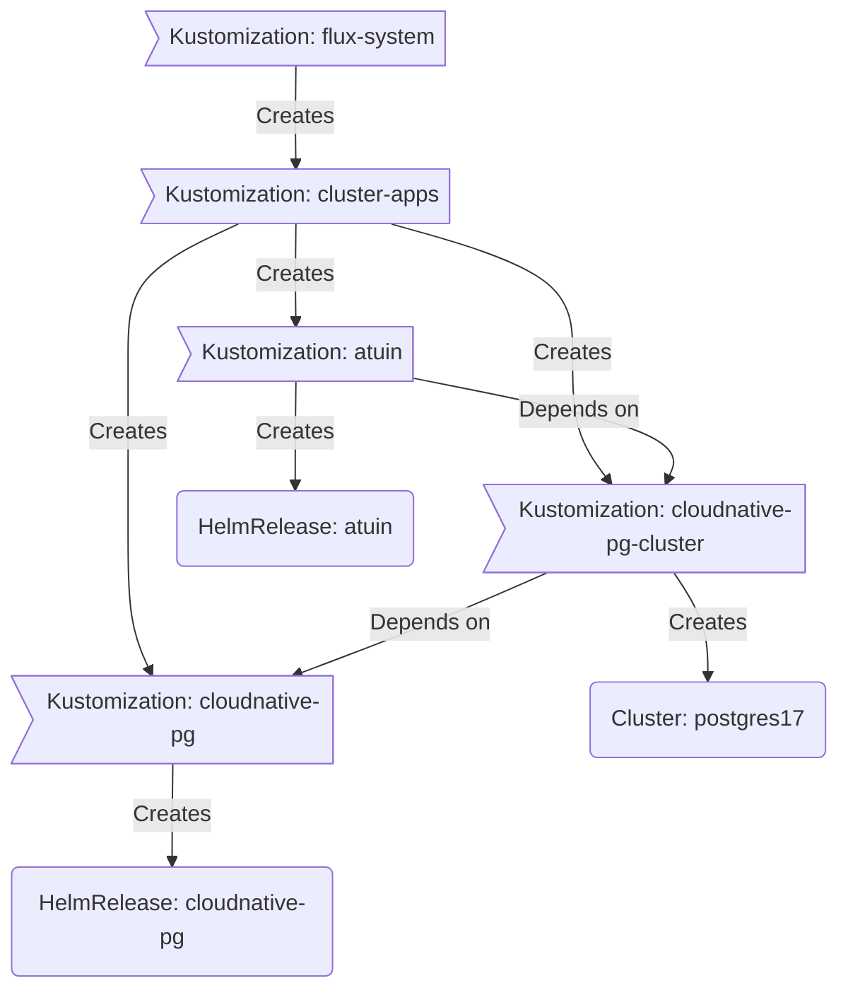

<div align="center">


# My Home(lab) Operations Repository

... managed with [Flux](https://github.com/fluxcd/flux2), [Renovate](https://github.com/renovatebot/renovate) and [GitHub Actions](https://github.com/features/actions)

</div>

<div align="center">

[](https://talos.dev)&nbsp;
[](https://kubernetes.io)&nbsp;
[](https://fluxcd.io)&nbsp;
[](https://github.com/pwyde/home-ops/actions/workflows/renovate.yaml)

</div>

<div align="center">

[](https://github.com/kashalls/kromgo)&nbsp;
[](https://github.com/kashalls/kromgo)&nbsp;
[](https://github.com/kashalls/kromgo)&nbsp;
[](https://github.com/kashalls/kromgo)&nbsp;
[](https://github.com/kashalls/kromgo)&nbsp;
[](https://github.com/kashalls/kromgo)&nbsp;
[](https://github.com/kashalls/kromgo)

</div>

---

### Overview

This is a mono repository for my home infrastructure and Kubernetes cluster. I try to adhere to Infrastructure as Code (IaC) and GitOps practices using tools like [Kubernetes](https://kubernetes.io/), [Flux](https://github.com/fluxcd/flux2), [Renovate](https://github.com/renovatebot/renovate), and [GitHub Actions](https://github.com/features/actions).

---

## Kubernetes

This semi hyper-converged cluster operates on [Talos Linux](https://www.talos.dev), an immutable and ephemeral Linux distribution tailored for [Kubernetes](https://kubernetes.io), and is deployed on [Proxmox VE](https://proxmox.com/en/products/proxmox-virtual-environment/overview) virtual machines. [TrueNAS SCALE](https://www.truenas.com/truenas-scale) supplies my workloads with persistent block and file storage. The cluster is designed to enable a full teardown without any data loss.

### Core Components

- [actions-runner-controller](https://github.com/actions/actions-runner-controller): Self-hosted Github runners.
- [cert-manager](https://github.com/cert-manager/cert-manager): Creates SSL certificates for services in my cluster.
- [cilium](https://github.com/cilium/cilium): eBPF-based CNI (Container Network Interface) for my workloads.
- [cloudflared](https://github.com/cloudflare/cloudflared): Enables Cloudflare secure access to my routes.
- [democratic-csi](https://github.com/democratic-csi/democratic-csi): CSI (Container Storage Interface) for persistent block and file storage.
- [external-dns](https://github.com/kubernetes-sigs/external-dns): Automatically syncs ingress DNS records to a DNS provider.
- [external-secrets](https://github.com/external-secrets/external-secrets): Managed Kubernetes secrets using [1Password Connect](https://github.com/1Password/connect).
- [sops](https://github.com/getsops/sops): Managed secrets for Talos and Kubernetes which are commited to Git.
- [spegel](https://github.com/spegel-org/spegel): Stateless cluster local OCI registry mirror.
- [volsync](https://github.com/backube/volsync): Backup and recovery of persistent volume claims.

### GitOps

[Flux](https://github.com/fluxcd/flux2) watches my [kubernetes](./kubernetes) directory and makes the changes to my clusters based on the state of my Git repository.

The way Flux works for me here is it will recursively search the [kubernetes/apps](./kubernetes/apps) folder until it finds the most top level `kustomization.yaml` per directory and then apply all the resources listed in it. That aforementioned `kustomization.yaml` will generally only have a namespace resource and one or many Flux kustomizations (`ks.yaml`). Under the control of those Flux kustomizations there will be a `HelmRelease` or other resources related to the application which will be applied.

[Renovate](https://github.com/renovatebot/renovate) monitors my **entire** repository for dependency updates, automatically creating a PR when updates are found. When some PRs are merged Flux applies the changes to my cluster.

### Directories

This Git repository contains the following directories under [kubernetes](./kubernetes).

```sh
📁 kubernetes
├── 📁 apps       # applications
├── 📁 components # re-useable kustomize components
└── 📁 flux       # flux system configuration
```

### Cluster Layout

This is a high-level look how Flux deploys my applications with dependencies. Below there are 3 Flux kustomizations `cloudnative-pg`, `cloudnative-pg-cluster`, and `atuin`. `cloudnative-pg` is the first app that needs to be running and healthy before `cloudnative-pg-cluster` and once `cloudnative-pg-cluster` is healthy `atuin` will be deployed.


