<div align="center">


##  My Home Operations Repository 

... a GitOps-driven homelab managed with [Flux](https://github.com/fluxcd/flux2), [Renovate](https://github.com/renovatebot/renovate), and [GitHub Actions](https://github.com/features/actions) 

</div>

<div align="center">

[](https://talos.dev/)&nbsp;
[](https://kubernetes.io/)&nbsp;
[](https://fluxcd.io/)&nbsp;
[](https://github.com/pwyde/home-ops/pulls)&nbsp;
[](https://github.com/pwyde/home-ops/actions/workflows/renovate.yaml)

</div>

<div align="center">

[](https://github.com/kashalls/kromgo)&nbsp;
[](https://github.com/kashalls/kromgo)&nbsp;
[](https://github.com/kashalls/kromgo)&nbsp;
[](https://github.com/kashalls/kromgo)&nbsp;
[](https://github.com/kashalls/kromgo)&nbsp;
[](https://github.com/kashalls/kromgo)&nbsp;
[](https://github.com/kashalls/kromgo)

</div>

---

##  Overview

This mono repository serves as the single source of truth for my home(lab) infrastructure and Kubernetes cluster, following Infrastructure as Code (IaC) and GitOps best practices. The cluster is semi-automated with tools like [Kubernetes](https://kubernetes.io/), [Flux](https://fluxcd.io/), [Renovate](https://github.com/renovatebot/renovate) and [GitHub Actions](https://github.com/features/actions).

This ensures an immutable and reproducible environment, with changes applied automatically based on repository state.

---

##  Kubernetes Architecture

The cluster operates on [Talos Linux](https://www.talos.dev/), an immutable and ephemeral Linux distribution tailored for [Kubernetes](https://kubernetes.io/), deployed on virtual machines running on [Proxmox VE](https://proxmox.com/en/products/proxmox-virtual-environment/overview). Persistent storage is provided by [TrueNAS SCALE](https://www.truenas.com/truenas-scale), ensuring data integrity and availability.

### Core Components

- **[actions-runner-controller](https://github.com/actions/actions-runner-controller):** Self-hosted GitHub runners.
- **[cert-manager](https://github.com/cert-manager/cert-manager):** Automated SSL certificate management.
- **[cilium](https://github.com/cilium/cilium):** eBPF-powered networking and security.
- **[cloudflared](https://github.com/cloudflare/cloudflared):** Secure Cloudflare Tunnel integration.
- **[democratic-csi](https://github.com/democratic-csi/democratic-csi):** CSI driver for persistent storage.
- **[external-dns](https://github.com/kubernetes-sigs/external-dns):** Automatic DNS management.
- **[external-secrets](https://github.com/external-secrets/external-secrets):** Managed Kubernetes secrets using [1Password Connect](https://github.com/1Password/connect).
- **[sops](https://github.com/getsops/sops):** Secure encryption for Talos configuration and Kubernetes secrets.
- **[spegel](https://github.com/spegel-org/spegel):** Stateless cluster local OCI registry mirror.
- **[volsync](https://github.com/backube/volsync):** Backup and restore solution for persistent volume claims.

---

##  GitOps Workflow

[Flux](https://fluxcd.io/) continuously monitors the repository and ensures the cluster state aligns with the desired configuration defined in the [kubernetes](./kubernetes) directory.

### Flux Deployment Strategy

Flux operates by recursively scanning the `kubernetes/apps` directory to identify the highest-level `kustomization.yaml` files within each application directory. These kustomizations generally define namespaces and Flux-managed resources (`ks.yaml`). Under these kustomizations, applications are deployed via `HelmRelease` including other resources related to the application.

[Renovate](https://github.com/renovatebot/renovate) automates dependency management across the entire repository. It continuously scans for updates and creates pull requests when new versions are available. Once merged, Flux applies the changes to the cluster, ensuring an up-to-date and secure environment.

### Repository Structure

```plaintext
├─📁 bootstrap         # Resources used during bootstrap process
├─📁 kubernetes        # Kubernetes cluster directory
│ ├─ 📁 apps           # Application manifests
│ ├─ 📁 components     # Reusable kustomize components
│ └─ 📁 flux           # Flux system configuration
├─📁 scripts           # Scripts used during bootstrap process
└─📁 talos             # Talos cluster configuration
  ├─ 📁 clusterconfig  # Talos node configuration files
  └─ 📁 patches        # Patches applied to Talos nodes
```

### Deployment Dependencies

Flux ensures applications are deployed in the correct sequence by managing dependencies between them. Typically, a `HelmRelease` depends on another `HelmRelease`, while a `Kustomization` may rely on another `Kustomization`. Occasionally, an application may require both a `HelmRelease` and a `Kustomization` before deployment. The example below illustrates a dependency chain where `cloudnative-pg` must be deployed and operational before `cloudnative-pg-cluster`, which in turn must be healthy before `atuin` is deployed.


---

##  Cloud Dependencies

While most services are self-hosted, certain critical components rely on cloud services to ensure availability, especially in bootstrapping scenarios.

| Service                                         | Purpose                                                                | Cost              |
|-------------------------------------------------|------------------------------------------------------------------------|-------------------|
| [1Password](https://1password.com/)             | Secret management via [External Secrets](https://external-secrets.io/) | ~€40/yr           |
| [Cloudflare](https://www.cloudflare.com/)       | DNS and secure access via Cloudflare Tunnel                            | Free              |
| [GitHub](https://github.com/)                   | Repository hosting and CI/CD                                           | Free              |
| [Mailgun](https://mailgun.com/)                 | Automatic email delivery                                               | Free (Flex Plan)  |
| [Name.com](https://www.name.com/)               | Domain registration                                                    | ~€55/yr           |
| [Pushover](https://pushover.net/)               | Infrastructure alerts and notifications                                | $5 (One Time Fee) |
| [Tailscale](https://tailscale.com/)             | Secure private remote access                                           | Free              |
|                                                 |                                                                        | **~€8/mo**        |

---

##  Network

### Network Diagram

```mermaid
graph LR;
  id1((Internet)) <-->|600Mbps↓ 50Mbps↑| id2[Netgate SG-3100];
  id2 <-->|1Gbps↕| id3[UniFi Pro 24 PoE];
  id3 <-->|10Gbps↕| id4[UniFi Aggregation];
  id3 <-->|1Gbps↕| id5["UniFi 8 (Gen1)"];
  id3 <-->|1Gbps↕| id6[2 x UniFi AC Pro];
  id3 <-->|1Gbps↕| id7[UniFi Cloud Key Gen2];
  id3 <-->|1Gbps↕| id8(Devices);
  id4 <-->|10Gbps↕| id9[Proxmox VE host];
  id4 <-->|10Gbps↕| id10[5 x Talos VMs];
  id4 <-->|10Gbps↕| id11[TrueNAS SCALE];
  id5 <-->|1Gbps↕| id12(Media & IoT devices);
  id6 <--> id13(WiFi clients);
```



### Networks & VLANs

| Name       | ID    | Description                             |
|------------|-------|-----------------------------------------|
| Management | `1`   | Default VLAN used as management network |
| Servers    | `20`  | VLAN for servers and services           |
| Devices    | `30`  | VLAN for devices and computers          |
| Kids       | `40`  | VLAN for kids                           |
| Media      | `50`  | VLAN for media devices/equipment        |
| Storage    | `100` | VLAN for NFS and iSCSI                  |
| IoT        | `200` | VLAN for IoT devices                    |
| Guest      | `210` | VLAN for guest devices                  |

---

##  DNS

_To be documented..._

---

##  Hardware

_To be documented..._

### Compute

### Storage

### Networking

| Vendor   | Model                | Count | Function                 |
|----------|----------------------|-------|--------------------------|
| Netgate  | SG-3100              | 1     | Firewall & Router        |
| Ubiquiti | UniFi Cloud Key Gen2 | 1     | UniFi Controller         |
| Ubiquiti | UniFi Aggregation    | 1     | 10G SFP+ Core Switch     |
| Ubiquiti | UniFi Pro 24 PoE     | 1     | 1GbE RJ45 PoE Switch     |
| Ubiquiti | UniFi 8 (Gen1)       | 1     | 1GbE RJ45 Utility Switch |
| Ubiquiti | UniFi AC Pro         | 2     | WiFi 5 Access Point      |

---

##  Thanks

A special thanks to the [Home Operations](https://discord.gg/home-operations) Discord community for their insights and inspiration. Many ideas stem from shared clusters under the [k8s-at-home](https://github.com/topics/k8s-at-home) GitHub topic and the excellent [Kubesearch](http://kubesearch.dev/) tool.

---

##  License

See [LICENSE](./LICENSE)
